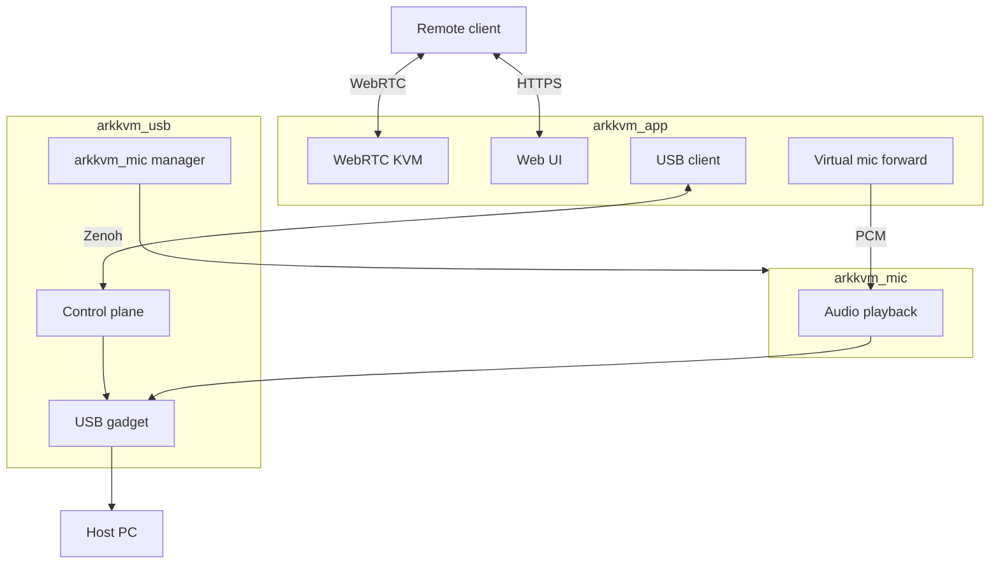

# ArkKVM App

> Open-source Rust firmware for [ArkKVM](https://www.arkkvm.com/) — the all-in-one remote KVM with BIOS-to-desktop access, 1080p@60Hz streaming, USB gadget emulation, and browser-based control.

[Website](https://www.arkkvm.com/) · [GitHub](https://github.com/arkkvm/arkkvm-app)

## Overview

This repository contains the Rust firmware that runs on [ArkKVM](https://www.arkkvm.com/) hardware. The main binary is `arkkvm_app`, which powers remote KVM over IP: BIOS/UEFI access, 1080p@60Hz video, two-way audio, virtual drive mounting and file transfer, ATX and Wake-on-LAN out-of-band control, a browser-based Web UI, and cloud remote access.

The firmware targets Rockchip RV1106 (`armv7-unknown-linux-uclibceabihf`). It is developed by Ark Intelligent. For product details and purchasing, visit [arkkvm.com](https://www.arkkvm.com/).

## Features

- **Remote KVM** — 1080p@60Hz WebRTC video and audio, Web Terminal, low-latency remote control
- **BIOS / out-of-band** — ATX power control, Wake-on-LAN, OTA firmware updates
- **USB gadget** — Keyboard and mouse, virtual CD/ISO mounting, file transfer, virtual microphone
- **Web & API** — Browser-based Web UI and JSON-RPC API
- **Network** — mDNS discovery, SSH, static IP and VLAN, Tailscale plugin
- **Cloud** — Built-in cloud relay with flexible local and remote access modes

## Architecture

Firmware on the device runs as three cooperating processes:

| Process | Binary | Repository |
|---------|--------|--------------|
| Main firmware | `arkkvm_app` | `arkkvm/` (this repo) |
| USB sidecar | `arkkvm_usb` | `crates/usb_devices/` (this repo) |
| Virtual mic | `arkkvm_mic` | [arkkvm-usb-mic](https://github.com/arkkvm/arkkvm-usb-mic) |

- **`arkkvm_app`** — KVM sessions, hardware capture, Web UI, cloud services, configuration, and coordination of USB and virtual-mic pipelines.
- **`arkkvm_usb`** — USB gadget configuration and device I/O (keyboard/mouse, mass storage, UAC1).
- **`arkkvm_mic`** — Virtual-microphone audio playback; spawned and monitored by `arkkvm_usb`.

Processes communicate over Zenoh. The main bus carries USB control messages (Protobuf). Virtual-microphone PCM uses a separate mic Zenoh session; `arkkvm_usb` manages the `arkkvm_mic` lifecycle.



**Virtual microphone** routes remote WebRTC audio into a UAC1 USB gadget on the host PC. `arkkvm_app` decodes incoming audio and forwards PCM; `arkkvm_mic` plays it to the USB audio path; `arkkvm_usb` exposes the gadget and controls the mic process. Source and build: [arkkvm-usb-mic](https://github.com/arkkvm/arkkvm-usb-mic).

## Related repositories

ArkKVM is split across several repositories for firmware, UI, audio, and system tooling:

| Component | Repository | Notes |
|-----------|--------------|-------|
| Product | [arkkvm.com](https://www.arkkvm.com/) | Product information |
| Firmware | [arkkvm-app](https://github.com/arkkvm/arkkvm-app) | This repo; builds `arkkvm_app` and `arkkvm_usb` |
| Web UI | [arkkvm-app-frontend](https://github.com/arkkvm/arkkvm-app-frontend) | UI source; this repo only contains `frontend/dist/` build output |
| Virtual microphone | [arkkvm-usb-mic](https://github.com/arkkvm/arkkvm-usb-mic) | Builds `arkkvm_mic` |
| System / toolchain | [arkkvm-system](https://github.com/arkkvm/arkkvm-system) | Cross toolchain and sysroot |

Each related repository maintains its own `LICENSE` and `NOTICE` files.

## Repository layout

| Path | Description |
|------|-------------|
| `arkkvm/` | Main firmware crate (`arkkvm_app`) |
| `crates/usb_devices/` | USB gadget manager (`arkkvm_usb` sidecar) |
| `crates/common/` | Shared logging and device helpers |
| `crates/rockchip_mpi_sys/` | Rockchip MPI FFI bindings |
| `proto/` | Protobuf definitions (`usb_devices.proto`) |
| `frontend/dist/` | Web UI build output from [arkkvm-app-frontend](https://github.com/arkkvm/arkkvm-app-frontend) |
| `cshim/` | C shims for cross-compilation (`getauxval.c`) |
| `examples/` | WebRTC and hardware integration examples |
| `build.sh` | Cross-compile entry script (see [Building](#building)) |

## Building

Firmware compilation requires artifacts from [arkkvm-system](https://github.com/arkkvm/arkkvm-system) (toolchain and sysroot). Those build steps are documented in that repository — not here.

### Requirements

- Linux host (amd64/x86_64) with [rustup](https://rustup.rs/)
- **C cross toolchain** — `arm-rockchip830-linux-uclibcgnueabihf/` (`BUILDKIT_ROOT`)
- **Sysroot libraries** — MPI libraries from the system build (e.g. `rockit`, `rockchip_mpp`, `rga`)
- **Opus** — prebuilt libraries at `../opus-1.5.1/lib` (`OPUS_LIB_DIR`)
- **Web UI output** — `frontend/dist/` from [arkkvm-app-frontend](https://github.com/arkkvm/arkkvm-app-frontend)

Suggested sibling directory layout:

```text
parent/
├── arkkvm-app/
├── arm-rockchip830-linux-uclibcgnueabihf/   # BUILDKIT_ROOT
├── opus-1.5.1/lib/                          # OPUS_LIB_DIR
└── rust/                                    # Rust source (stage2 toolchain)
```

### Rust toolchain

Firmware builds use `cargo build -Z build-std`. Build a **stage2** toolchain from Rust source tag **`1.94.1`** — do not substitute an arbitrary nightly release.

| Item | Value |
|------|-------|
| Rust source tag | **`1.94.1`** |
| Linked toolchain | `stage2` |
| Firmware target | `armv7-unknown-linux-uclibceabihf` |

```bash
git clone https://github.com/rust-lang/rust
cd rust && git checkout tags/1.94.1 -b v1.94.1 && touch bootstrap.toml
```

Add to `bootstrap.toml` (set `cc` to the absolute path of the cross GCC under `BUILDKIT_ROOT`):

```toml
[build]
target = ["x86_64-unknown-linux-gnu", "armv7-unknown-linux-uclibceabihf"]

[target.armv7-unknown-linux-uclibceabihf]
cc = "/absolute/path/to/arm-rockchip830-linux-uclibcgnueabihf/bin/arm-rockchip830-linux-uclibcgnueabihf-gcc"
```

```bash
./x.py build --stage 2
rustup toolchain link stage2 build/x86_64-unknown-linux-gnu/stage2
```

Use **`cargo +stage2`** when building firmware. Rust bootstrap host dependencies: [Rust INSTALL.md](https://github.com/rust-lang/rust/blob/master/INSTALL.md). Platform notes: [armv7-unknown-linux-uclibceabihf](https://doc.rust-lang.org/nightly/rustc/platform-support/armv7-unknown-linux-uclibceabihf.html).

`bindgen-cli` is installed automatically by `build.sh` if missing.

### Build commands

```bash
./build.sh                          # production build
./build.sh <version>                # bump package version
./build.sh <version> 1              # development channel (env_dev)
```

| Argument | Description |
|----------|-------------|
| `$1` version | Optional; updates version in `arkkvm/Cargo.toml` and `crates/usb_devices/Cargo.toml` |
| `$2` dev_channel | Optional; `1` enables `env_dev`, otherwise production |

`build.sh` sets `BUILDKIT_ROOT`, `OPUS_LIB_DIR`, and the cross linker automatically. For manual builds:

```bash
export BUILDKIT_ROOT="$(realpath ../arm-rockchip830-linux-uclibcgnueabihf)"
export OPUS_LIB_DIR="$PWD/../opus-1.5.1/lib"
export CARGO_TARGET_ARMV7_UNKNOWN_LINUX_UCLIBCEABIHF_LINKER="$BUILDKIT_ROOT/bin/arm-rockchip830-linux-uclibcgnueabihf-gcc"

cargo +stage2 build -Z build-std --release --target armv7-unknown-linux-uclibceabihf
```

**Pre-build checklist:** `stage2` from Rust 1.94.1 · `frontend/dist/` present · toolchain paths match layout above.

**Outputs:**

| Binary | Path |
|--------|------|
| `arkkvm_app` | `target/armv7-unknown-linux-uclibceabihf/release/arkkvm_app` |
| `arkkvm_usb` | `target/armv7-unknown-linux-uclibceabihf/release/arkkvm_usb` |

**Troubleshooting:** `BUILDKIT_ROOT not set` — export toolchain path · `Cross-compile getauxval.c failed` — incomplete sysroot · missing `frontend/dist` — build UI from [arkkvm-app-frontend](https://github.com/arkkvm/arkkvm-app-frontend) first.

## Runtime notes

Configuration and persistent data live under `/userdata/arkkvm/`:

| Path | Purpose |
|------|---------|
| `/userdata/arkkvm/` | Config and persistent data |
| `/userdata/arkkvm/logs/` | Application logs |
| `/userdata/arkkvm/certs/` | TLS certificates |
| `/userdata/arkkvm/ota/` | OTA packages |

Cargo feature flags:

| Feature | Description |
|---------|-------------|
| `env_dev` | Development channel |
| `env_unsafe` | Unsafe development options |

## External dependencies

Building from this repository requires components **not included** in this
repository:

| Component | Notes |
|-----------|-------|
| Cross toolchain + Rockchip SDK sysroot (`BUILDKIT_ROOT`) | Proprietary `.so` libraries (librockit, MPP, RGA, etc.); see [arkkvm-system](https://github.com/arkkvm/arkkvm-system) |
| Prebuilt libopus (`OPUS_LIB_DIR`) | BSD-3-Clause; see [build.sh](build.sh) |
| Web UI (`frontend/dist/`) | Built from [arkkvm-app-frontend](https://github.com/arkkvm/arkkvm-app-frontend) |
| Virtual microphone (`arkkvm_mic`) | Separate binary from [arkkvm-usb-mic](https://github.com/arkkvm/arkkvm-usb-mic) |
| Embedded disk image (`assets/images/netboot.xyz-multiarch.iso`) | [netboot.xyz](https://github.com/netbootxyz/netboot.xyz) multiarch ISO (Apache-2.0); embedded into `arkkvm_app` via `rust-embed` for virtual media |

The crate `crates/rockchip_mpi_sys` contains FFI bindings only; library
binaries come from the vendor SDK sysroot.

This license applies to source code in **this repository** only.

## License

ArkKVM App is licensed under **GPL-2.0-or-later**. Official releases of this
repository are distributed under **GNU GPL version 3** to remain compatible
with Apache-2.0 dependencies (see [NOTICE](NOTICE)).

| Document | Description |
|----------|-------------|
| [LICENSE](LICENSE) | GNU GPL v2 full text |
| [NOTICE](NOTICE) | Copyright and GPLv3 distribution election |
| [THIRD_PARTY_NOTICES](THIRD_PARTY_NOTICES) | Rust/Cargo dependencies (`Cargo.lock`; auto-generated) |

[`THIRD_PARTY_NOTICES`](THIRD_PARTY_NOTICES) is generated from
[`Cargo.lock`](Cargo.lock) and lists **Rust crate** licenses only. After
changing dependencies, regenerate:

```bash
cargo install cargo-about --locked --features cli
cargo about generate about.hbs -o THIRD_PARTY_NOTICES
```